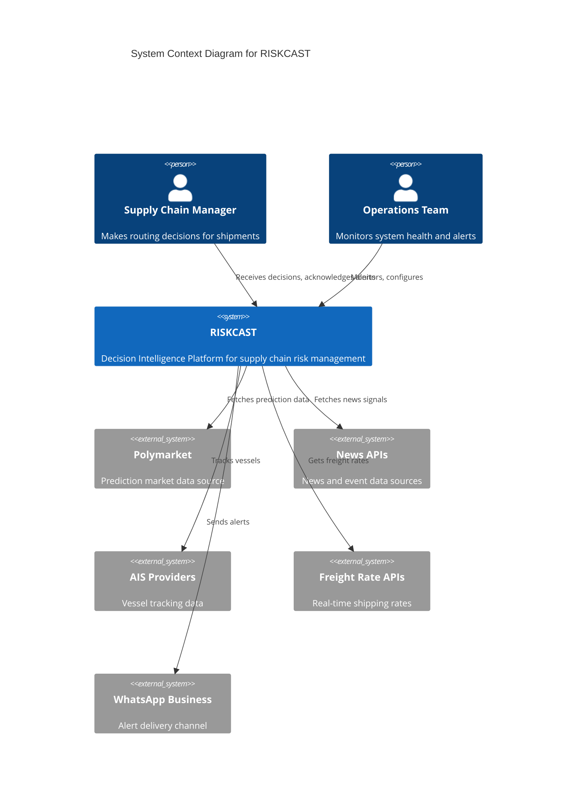
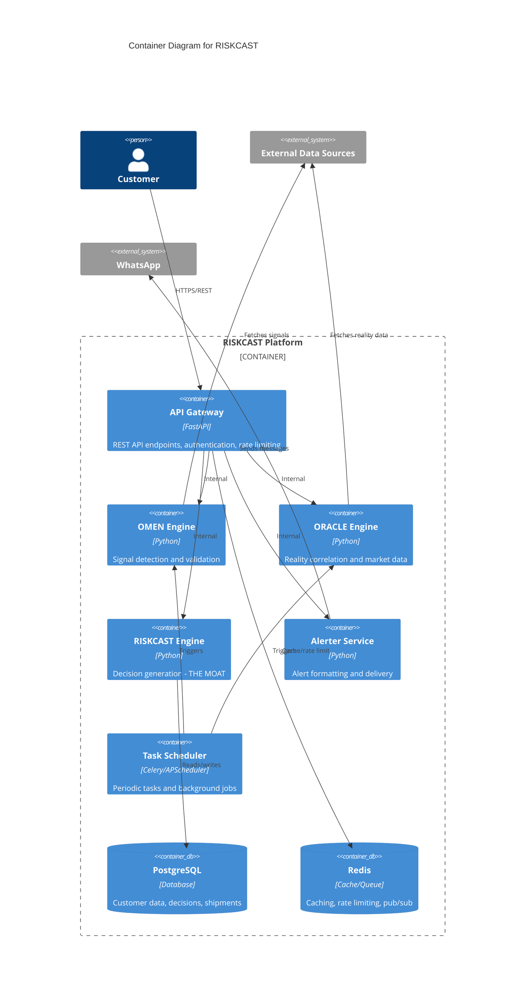
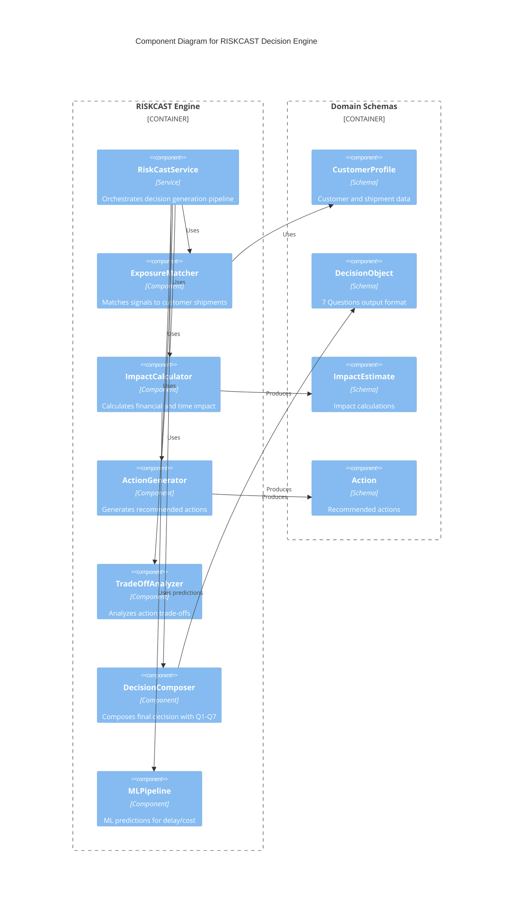
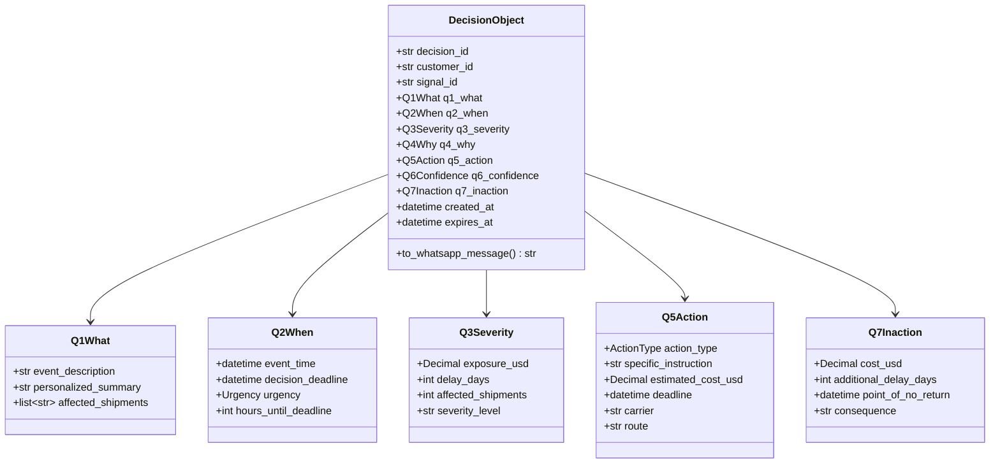
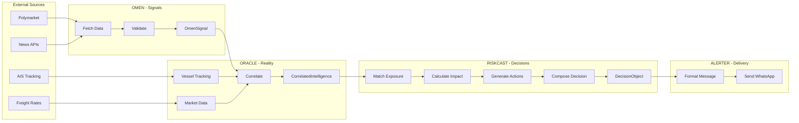
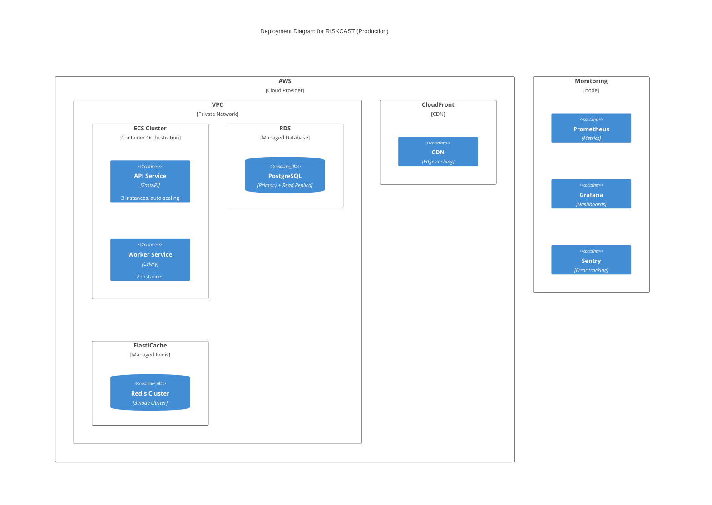
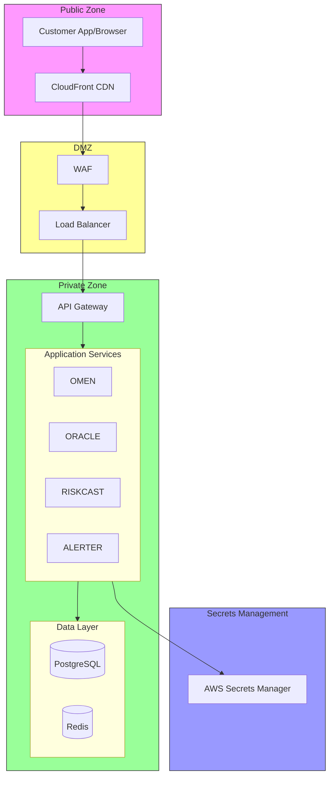

# RISKCAST Architecture - C4 Diagrams

## Overview

This document provides C4 model architecture diagrams for the RISKCAST Decision Intelligence Platform.

---

## Level 1: System Context



### Context Description

RISKCAST is a decision intelligence platform that:
- **Ingests** signals from multiple external data sources (prediction markets, news, AIS, rates)
- **Correlates** signals with customer shipment data
- **Generates** personalized, actionable decisions
- **Delivers** alerts via WhatsApp with specific costs, deadlines, and inaction consequences

---

## Level 2: Container Diagram



### Container Descriptions

| Container | Purpose | Technology |
|-----------|---------|------------|
| **API Gateway** | Entry point for all requests, authentication, rate limiting | FastAPI, Pydantic |
| **OMEN Engine** | Detects and validates signals from external sources | Python, httpx |
| **ORACLE Engine** | Correlates signals with real-world data (AIS, rates) | Python, httpx |
| **RISKCAST Engine** | Generates personalized decisions (7 Questions) | Python, ML Pipeline |
| **Alerter Service** | Formats and delivers alerts | Python, WhatsApp API |
| **Task Scheduler** | Periodic data fetching, cleanup jobs | APScheduler |
| **PostgreSQL** | Persistent storage for all business data | PostgreSQL 15 |
| **Redis** | Caching, rate limiting, event pub/sub | Redis 7 |

---

## Level 3: Component Diagram - RISKCAST Engine



### Decision Generation Pipeline

```
1. ExposureMatcher
   - Input: Signal + CustomerProfile
   - Output: List of affected shipments with exposure amounts

2. ImpactCalculator
   - Input: Affected shipments + Signal severity
   - Output: ImpactEstimate (cost in USD, delay in days)

3. ActionGenerator
   - Input: ImpactEstimate + Customer preferences
   - Output: Ranked list of Actions

4. TradeOffAnalyzer
   - Input: Actions list
   - Output: Actions with trade-off analysis

5. DecisionComposer
   - Input: All above
   - Output: DecisionObject (7 Questions answered)
```

---

## Level 3: Component Diagram - OMEN Engine

```mermaid
C4Component
    title Component Diagram for OMEN Signal Engine

    Container_Boundary(omen, "OMEN Engine") {
        Component(service, "OmenService", "Service", "Orchestrates signal detection")
        
        Component_Boundary(sources, "Signal Sources") {
            Component(polymarket, "PolymarketSource", "Source", "Prediction market signals")
            Component(news, "NewsSource", "Source", "News-based signals")
            Component(social, "SocialSource", "Source", "Social media signals")
        }
        
        Component_Boundary(validators, "Validators") {
            Component(freshness, "FreshnessValidator", "Validator", "Checks signal recency")
            Component(confidence, "ConfidenceValidator", "Validator", "Validates data quality")
            Component(duplicate, "DuplicateValidator", "Validator", "Deduplicates signals")
            Component(relevance, "RelevanceValidator", "Validator", "Checks chokepoint relevance")
        }
        
        Component(aggregator, "SignalAggregator", "Component", "Combines multi-source signals")
    }
    
    Rel(service, polymarket, "Fetches")
    Rel(service, news, "Fetches")
    Rel(service, social, "Fetches")
    Rel(service, freshness, "Validates")
    Rel(service, confidence, "Validates")
    Rel(service, duplicate, "Validates")
    Rel(service, relevance, "Validates")
    Rel(service, aggregator, "Aggregates")
```

---

## Level 4: Code Diagram - Decision Object



---

## Data Flow Diagram



---

## Deployment Diagram



---

## Security Architecture



### Security Layers

1. **Edge Security**
   - CloudFront for DDoS protection
   - WAF rules for common attacks
   - TLS 1.3 encryption

2. **Authentication**
   - API key authentication
   - JWT tokens for sessions
   - Role-based access control

3. **Data Protection**
   - Encryption at rest (AES-256)
   - Encryption in transit (TLS)
   - Field-level encryption for PII

4. **Network Security**
   - VPC isolation
   - Security groups
   - Private subnets for data layer

---

## References

- [C4 Model](https://c4model.com/)
- [RISKCAST Architecture Decision Records](./decisions/)
- [API Documentation](../api/)
